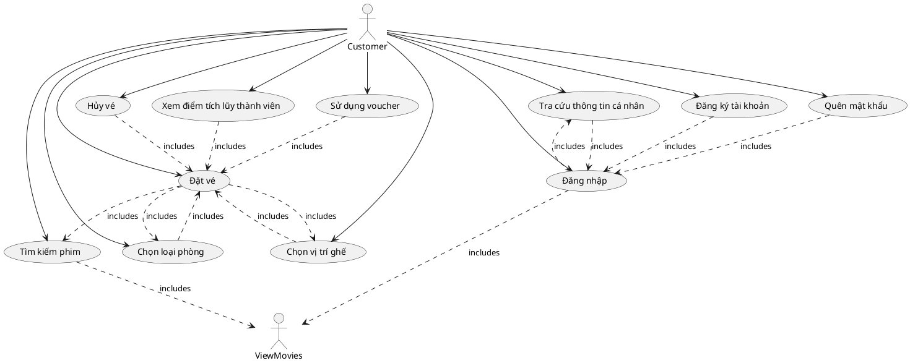

# Quy trình làm dự án luận văn tốt nghiệp

**Vẽ sơ đồ use case**: Bắt đầu với việc vẽ sơ đồ use case. Sơ đồ use case giúp bạn hiểu rõ các chức năng và tương tác giữa người dùng và hệ thống. Nó định nghĩa các use case chính và quan hệ giữa chúng, giúp bạn xác định yêu cầu chức năng cần thiết cho cơ sở dữ liệu.

**Thiết kế cơ sở dữ liệu**: Sau khi bạn đã hiểu các chức năng và yêu cầu chức năng từ sơ đồ use case, bạn có thể bắt đầu thiết kế cơ sở dữ liệu. Thiết kế cơ sở dữ liệu bao gồm việc xác định các thực thể, mối quan hệ giữa chúng, thuộc tính và ràng buộc. Điều này giúp bạn xác định cấu trúc dữ liệu và quan hệ giữa các thành phần trong hệ thống.

**Vẽ sơ đồ ERD**: Sơ đồ Entity-Relationship Diagram (ERD) được tạo ra từ thiết kế cơ sở dữ liệu. ERD giúp bạn biểu diễn mối quan hệ giữa các thực thể trong cơ sở dữ liệu bằng cách sử dụng các thực thể, quan hệ và thuộc tính. ERD giúp bạn hiểu và trình bày mô hình dữ liệu theo một cách trừu tượng và dễ hiểu.

**Sơ đồ CDM**: Sau khi hoàn thành ERD, bạn có thể tạo sơ đồ Cơ sở dữ liệu mô hình (CDM). Sơ đồ CDM tập trung vào mô tả các thực thể và mối quan hệ chung của dữ liệu mà không liên quan đến các yếu tố vật lý của cơ sở dữ liệu. Nó giúp bạn tạo ra một mô hình logic dữ liệu rõ ràng và dễ dàng hiểu.

**Sơ đồ PDM**: Cuối cùng, từ sơ đồ CDM, bạn có thể chuyển sang thiết kế sơ đồ Vật lý (PDM). Sơ đồ PDM tập trung vào các khía cạnh vật lý của cơ sở dữ liệu như bảng, cột, kiểu dữ liệu, chỉ mục, ràng buộc, v.v. Sơ đồ PDM cung cấp chi tiết về cấu trúc cơ sở dữ liệu cụ thể và giúp bạn triển khai cơ sở dữ liệu theo yêu cầu kỹ thuật.

